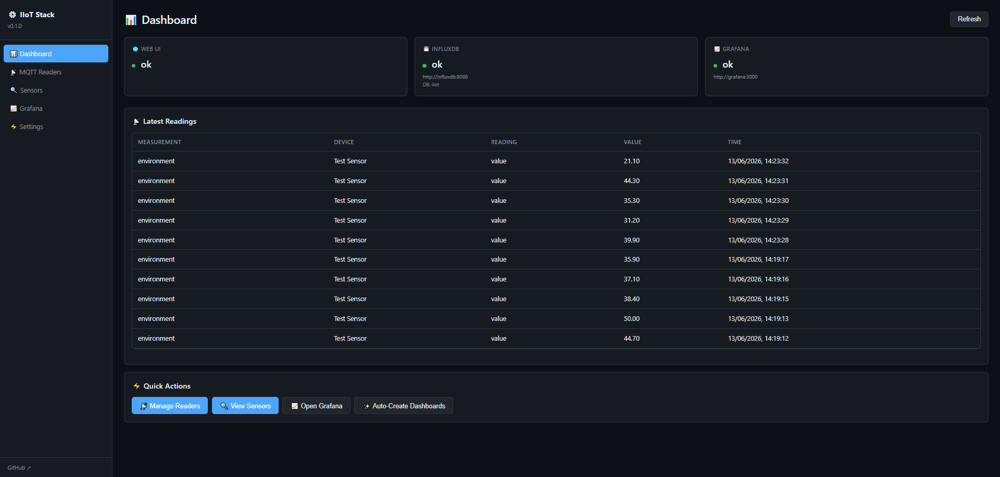
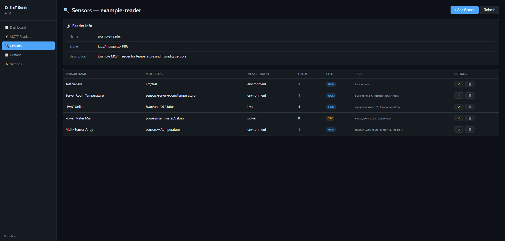
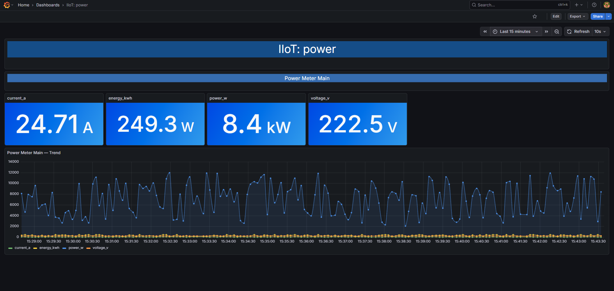

# Industrial IoT Observability Stack

[](https://github.com/Sandun-S/industrial_iot_observability_stack/releases)

**Turn MQTT sensor data into live Grafana dashboards — in one command.**

This is an open-source observability stack for industrial IoT and homelab use. Connect any MQTT-enabled device or sensor, and within minutes you'll have time-series storage, auto-generated dashboards, and a web UI to manage everything — no cloud, no vendor lock-in, no monthly fees.

## What It Does

```
Your MQTT Devices → Mosquitto → MQTT Reader → InfluxDB → Grafana Dashboards
                                              ↑               ↑
                                         Web UI manages    Auto-created
                                         sensors & topics   per measurement
```

- **Ingest** MQTT data from any device (JSON or CSV payloads)
- **Store** everything in InfluxDB — a purpose-built time-series database
- **Visualize** with Grafana — dashboards auto-created per measurement
- **Manage** from a browser-based Web UI — add sensors, MQTT endpoints, view latest readings
- **Runs anywhere** — Raspberry Pi, home server, cloud VM. Docker Swarm or plain Compose.

> **📡 Currently supports MQTT.** More protocols (Modbus, OPC-UA, SNMP, HTTP) planned for future releases.

## Two Ways to Get MQTT Data

This stack works both ways — pick the one that fits your setup:

| Mode | How it works | When to use |
|------|-------------|-------------|
| **Built-in broker** | Stack includes Mosquitto. Your devices publish data **to us**. Reader subscribes locally. | You're starting fresh, no existing MQTT infrastructure. |
| **External broker** | Point our MQTT Reader at your existing broker. It subscribes to topics **from you**. | You already have Mosquitto/EMQX/VerneMQ/HiveMQ running somewhere. |

Both modes are configured the same way — just set the broker URL when adding a reader in the Web UI:
- Built-in: `tcp://mosquitto:1883` (default, uses the included Mosquitto)
- External: `tcp://192.168.1.100:1883` (your existing broker)

### Can external devices reach the built-in broker?

**Yes.** Port 1883 is published to the host, so any device on the same network can publish to `<host-ip>:1883`.

| Scenario | Setup needed |
|----------|-------------|
| Devices on same LAN | Nothing — just point them at `<host-ip>:1883` |
| Devices on different network | Port forward TCP 1883 on your router, or use a VPN (Tailscale/WireGuard) |
| Cellular / LoRa / remote devices | Use **External broker** mode — point our MQTT Reader at a cloud broker (e.g. HiveMQ, EMQX Cloud) |

> ⚠️ The built-in Mosquitto has no authentication enabled. Only expose port 1883 to the internet if you're on a trusted network.

## Quick Start

```bash
git clone https://github.com/Sandun-S/industrial_iot_observability_stack_deploy.git
cd industrial_iot_observability_stack_deploy
./scripts/setup.sh
```

After 2-3 minutes:

| Service | URL | Credentials |
|---------|-----|-------------|
| **Web UI** | `http://<your-ip>:8080` | No auth |
| **Grafana** | `http://<your-ip>:3000` | admin / admin |
| **InfluxDB** | `http://<your-ip>:8086` | No auth (db: iiot) |
| **MQTT Broker** | `<your-ip>:1883` | No auth |

### Screenshots

| Web UI Dashboard | Sensor Management | Auto-Created Grafana Dashboard |
|:---:|:---:|:---:|
|  |  |  |

## Requirements

- **Linux** server or Raspberry Pi (amd64 / arm64 / armv7)
- **Docker** (auto-installed if missing — fresh OS is fine)
- 512MB+ RAM, 2GB+ disk

---

## First Steps After Setup

### 1. Enable dashboard auto-creation (one-time)

Open Grafana → create a service account token so the Web UI can auto-create dashboards:

1. `http://<your-ip>:3000` → login `admin` / `admin`
2. **Administration** → **Users and access** → **Service accounts**
3. **Add service account** → Display name: `Admin role` → Role: **Admin** → **Create**
4. **Add service account token** → **Generate token** → copy it
5. Open Web UI → ⚡ Settings → paste token → Save

### 2. Add your MQTT sensors

Open `http://<your-ip>:8080` → **📡 MQTT Readers**:

- Click **+ Add Reader** → fill in your MQTT broker URL, name it
- Click **🔍 Sensors** on the reader → **+ Add Sensor**
- For each sensor: give it a name, MQTT topic, measurement name, and field mapping

Everything is done from the browser. No YAML files, no SSH.

> 📖 **Detailed guide:** See [GUIDE.md](GUIDE.md) for field-by-field explanations, JSON path mapping examples, CSV setup, wildcard topics, and troubleshooting.

### 3. Publish data

Point your devices at `<your-ip>:1883`, or test manually:

```bash
# Install mosquitto client (for testing)
sudo apt install mosquitto-clients -y

# Publish a test reading
mosquitto_pub -h localhost -t 'iiot/test' -m '{"value": 42.5}'
```

### 4. Create dashboards

Once data is flowing, Web UI Dashboard → **✨ Auto-Create Dashboards** → opens in Grafana.

---

## MQTT Simulator (for testing)

Generates fake temperature, humidity, and power data so you can test the full pipeline without real hardware:

```bash
# Install dependencies (Debian/Ubuntu)
sudo apt install python3-paho-mqtt mosquitto-clients -y

# Run the simulator
python3 examples/mqtt-simulator.py --host localhost
```

For non-Debian systems: `pip install paho-mqtt --break-system-packages` or use a venv.

---

## Managing Everything from Web UI

| Task | Where |
|------|-------|
| Add MQTT broker | 📡 Readers → + Add Reader |
| Add sensor | 🔍 Sensors → select reader → + Add Sensor |
| Edit sensor | 🔍 Sensors → ✏️ on sensor row |
| Delete sensor | 🔍 Sensors → 🗑️ on sensor row |
| View last 50 readings | 📊 Dashboard |
| Auto-create Grafana dashboards | 📊 Dashboard → ✨ Auto-Create |
| Open Grafana | 📈 Grafana |
| Update settings | ⚡ Settings |

---

## Raspberry Pi

```bash
# Flash Raspberry Pi OS (64-bit) to SD card, boot, SSH in, then:
curl -fsSL https://raw.githubusercontent.com/Sandun-S/industrial_iot_observability_stack_deploy/main/scripts/setup.sh | bash
```

Docker gets installed, Swarm initialized, stack deployed. Works on Pi 3, 4, and 5.

---

## Updating

```bash
cd industrial_iot_observability_stack_deploy
git pull
./scripts/deploy.sh
```

---

## Architecture

See [ARCHITECTURE.md](ARCHITECTURE.md) for the full component and data flow documentation.

---

**Source code:** [industrial_iot_observability_stack](https://github.com/Sandun-S/industrial_iot_observability_stack)
